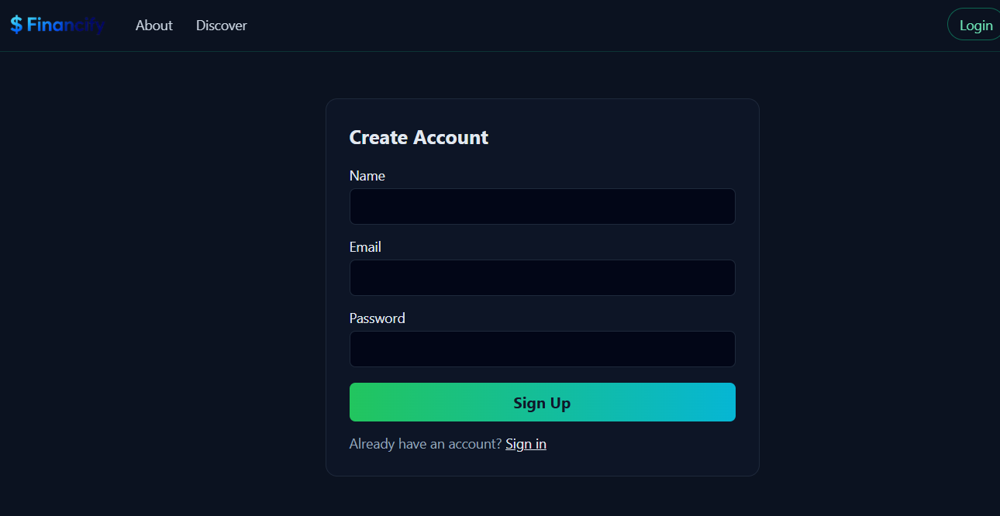
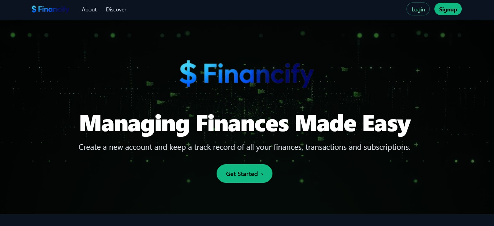
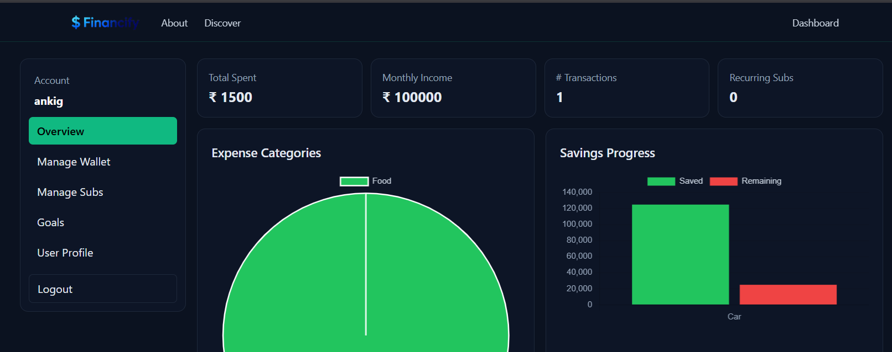

# 💵 Financify – Your Finance Buddy

Financify is a full-stack personal finance management application designed to help users track expenses, manage budgets, and build smarter money habits.  
It consists of a **Spring Boot backend** and a **Vite + Tailwind + JavaScript frontend**.

---

## 🖼️ UI Preview (Screenshots)

| Login / Signup | Dashboard | After Login View |
|---------------|-----------|------------------|
|  |  |  |

---


## 🌃 Features

- 🎫 Expense tracking by category  
- 🎫 Budget planning and analytics  
- 🎫 Secure authentication using JWT  
- 🎫 REST API built using Spring Boot  
- 🎫 Responsive UI designed with Tailwind CSS  
- 🎫 Clean folder separation: `/Backend` and `/Frontend`  

---

## 📂 Project Structure

```

FINANCIFY_PROJECT_SEM_5/
│── Backend/        # Spring Boot backend API
│── Frontend/       # Vite + Tailwind frontend
│── README.md
│── package.json
│── vite.config.js
│── tailwind.config.js
└── .gitignore

````

---

## 🛠️ Tech Stack

| Layer | Technology |
|-------|------------|
| **Frontend** | Vite, JavaScript, Tailwind CSS |
| **Backend** | Spring Boot, Hibernate, MySQL |
| **Auth** | JWT Based Authentication |
| **Build Tools** | Maven, npm |
| **Database** | MySQL / PostgreSQL (configurable) |

---

## 🍺📍 How to Run the Project

### 🔹 1️⃣ Clone the repository
```bash
git clone https://github.com/your-username/financify.git
````

### 🔹 2️⃣ Run the Backend (Spring Boot)

```bash
cd Backend
```

Run the main Spring Boot file:

```
src/main/java/.../DemoApplication.java
```

Or run using Maven:

```bash
mvn spring-boot:run
```

Backend will start at:

```
http://localhost:8080
```

### 🔹 3️⃣ Go back to root folder

```bash
cd ..
```

### 🔹 4️⃣ Run the Frontend (Vite)

```bash
cd Frontend
npm install
npm run dev
```

Frontend will start at:

```
http://localhost:5173
```

---

## 🔐 Backend Environment Variables (application.properties)

Create this file inside:

```
Backend/src/main/resources/application.properties
```

```properties
spring.datasource.url=jdbc:mysql://localhost:3306/financify
spring.datasource.username=your_username
spring.datasource.password=your_password

app.jwt.secret=your_secret_key
app.jwt.expiration=86400000
```

---

## 🔮 Future Enhancements
 
* AI-based spending insights
* PDF export of reports
* Notifications & reminders
* Multi-currency support

---

##  Contributing

Pull requests, issues, and feedback are welcome!
If you'd like to improve the UI, API, or documentation — feel free to contribute.

---

## ⭐ Support the Project

If you like Financify, consider **starring ⭐ the repository** — it motivates development!

---

## 📜 License

This project is licensed under the **MIT License**.
